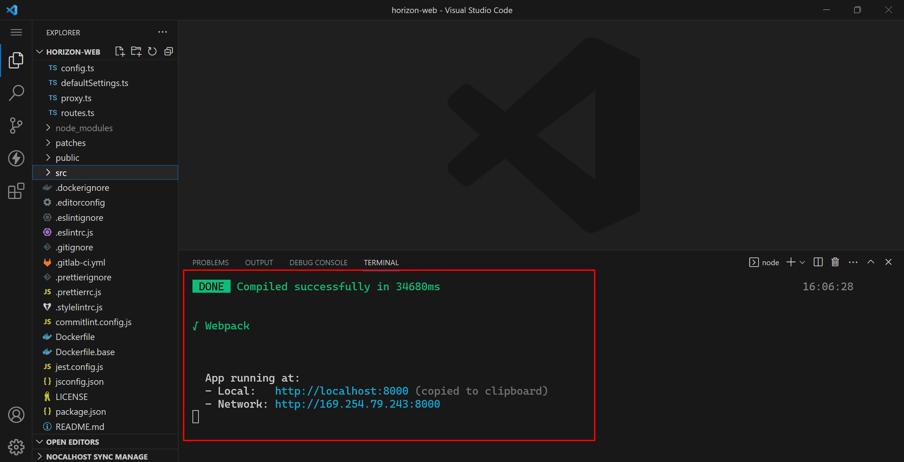
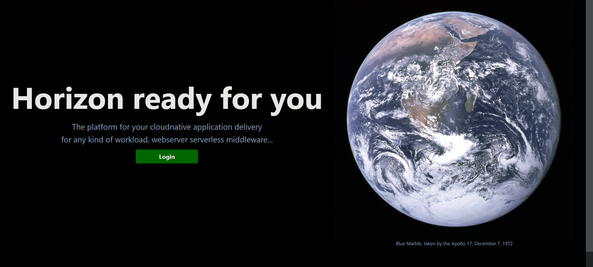

# Developing

The main development of Horizon is concentrated on horizon-core and horizon-web. The fallowing method is proposed to facilitate your development and debugging:

## Requirements

* Hardware: 4 CPU, 8 GB
* Language environment:
    * [golang](https://go.dev/) (version >= 1.15)
    * [node.js](https://nodejs.org/en/) (version >= v16)

* IDE: vscode, goland, etc.
* [Nocalhost extension](https://nocalhost.dev/docs/quick-start/).

## Horizon-core

Horizon-core is a web server built with gin framework. Due to its complex interaction with other components, nocalhost, a cloud-native development tool, could be used to improve your development and debugging.

Nocalhost can help you to connect directly to the Kubernetes cluster using KubeConfig with one click, and enjoy the coding in-cluster, which gets rid of the pesky local environment configurations. See: [Nocalhost Introduction](https://nocalhost.dev/docs/introduction).

### Install Nocalhost Extension

1. Open the extension market of your favourite IDE.
2. Input `Nocalhost` in the search box.
3. Select the `Nocalhost Extension`, and click the **Install** button.

For example in goland:


### Connect to Kubernetes Cluster

1. Click on the Nocalhost icon on the side panel, open the Nocalhost plugin.
2. Click the `+` button to add your kubeconfig path or content, then select context and namespace.


3. If successful, your kubernetes cluster will be `ACTIVE` shown in Nocalhost panel.


> Note that just like `kubectl`, you can access any kubernetes cluster by nocalhost with a proper kubeconfig, no matter kind or cloud k8s.

### Start DevMode

1. Expand your cluster in nocalhost panel, and click `horizoncd` -> `horizon` ->`Deployments`.

2. Right-click the workload `horizon-core` and click `Start DevMode` .
   

### Remote Debug

1. Click `Remote Debug` in the right-click menu, and wait for the project to start.
   

2. The following logs shown in IDE debug panel indicate that the project is running.
   

   Now, you can add breakpoints in your code and debug them.

   

## Horizon-web

Horizon-web only communicates with horizon-core, which is exposed by the ingress domain. Therefore, you can easily run and debug it using the following method:

### Change Proxy

1. Open [horizon-web](https://github.com/horizoncd/horizon-web) project in your IDE, then open `config/proxy.ts` file.
2. Change proxy `target` to forward requests to horizon-core deployed in your kubernetes.

```ts
// config/proxy.ts
export default {
  dev: {
    '/apis/': {
      // target: 'http://localhost:8080',
      target: 'http://horizon.localtest.me',
      changeOrigin: true,
      pathRewrite: { '^': '' },
    },
  },
};
```

### Debug

1. Prepare all dependencies of the project and then start it using the `yarn` command line tool.

```shell
# prepare
yarn
# start
yarn start
```

> You can see all scripts of `yarn` in fille `package.json`, which is useful during your development.

2. When the project is running, visit http://localhost:8000 to check your local web service for debugging.

   

   