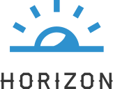
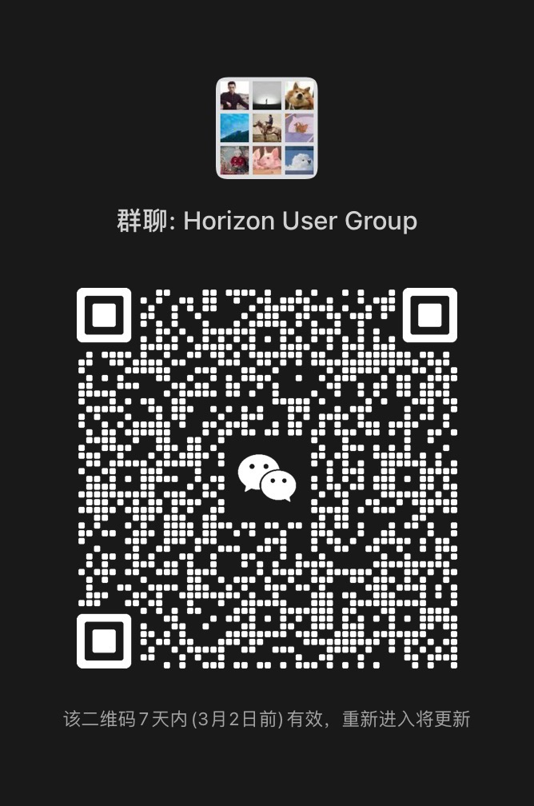

   

# Horizon

> English | [中文](README_ZH-CN.md)

Horizon is a cloud-native application Continues Delivery (CD) platform. Platform team can let the developers deploy their code and MiddleWares to cloud and kubernetes easily, efficiency and with best practice. Horizon is inspired by ArgoCD and AWS Proton.

## Why Horizon

1. **standardized** : kubernetes is flexible and powerful, but it is complex. it's hard to let all the developers have a comprehensive understanding of kubernetes and practice best practice. so horizon introduce a template system to make the best practice under control, and also provide efficient delivery. For example, Platform Team can provide basic spec of resource tiny(0.5core, 512MB)、small(1core, 1GB), middle(2core, 4GB) etc. by default, not for the developer to select limit or request resource on common case.
2. **security and reliable** ：security and reliable is always a challenge. In Horizon, Horizon make every change of application durable, reversible and auditable. It's done with our best practice of GitOps. And Horizon introduce rbac&member system to let you have best practice on fine-grained permission control.
3. **multi-cloud** : Horizon provide a consistent application platform to manage multi-cloud, hybrid cloud.
4. **infrastructure agnostic** ：horizon doesn't limit the kind of workload. the basic kubernetes workloads and self defined [CR](https://kubernetes.io/docs/concepts/extend-kubernetes/api-extension/custom-resources/) are all supported.
5. **efficiency** ：platform team can quickly make an end to end best practice workload delivery based on Horizon template.
6. **Production-Grade**：Within [NetEase Cloud Music](https://music.163.com/) about thousands of developer use horizon to deploy workload everyday.

## Features

### GitOps

In Horizon, Git is Used as the only "The Source Of Truth", Horizon stores template and all values in Git repository. Every change are durable, reversible and auditable, Including code, image, environment variables, resource spec, etc.

### Horizon Template

Horizon Template is based on helm and jsonschema. The Platform Team can make the basic practice (including security, affinity, priority, resource, etc.) by default, and provide user a simple and uniform interface which is defined by jsonschema files. jsonschema is used for provide a user friend HTML form on the Horizon Based on react-jsonschema-form. It's highly Scalable and flexible to make your own best practice based on the simple template system.

### RBAC & Member

Horizon Provide a RBAC & Member system Just like Gitlab. You can easily define your Own PlatForm Member and Role(Just like Kubernetes role and rolebinding). In our Practice, we Provide Role like PE, Owner, Maintainer, Guest. the Owner is binding with the Read(list pods, read all properties, etc.)/Write(deploy, builddeploy, restart, release, delete etc.) Permission, the guest just have the read permission.

### Ease For Integration

Horizon Provide OpenAPI, AccessToken, Oauth2.0, IDP Connector, Webhooks. It makes easy to d integrate internal system.

### Ease For use

We Also Provide Product Features, Like Template Management, Kubernetes Management, Monitoring Management, Environment Management. PlatForm Team can easily set up through the horizon web ui.

### Architecture

#### Horizon-Core

The Horizon Core Server is the Rest Server which export the OpenAPIs consume by the Web UI, CLI, and other systems. it also provides features like:

* Kubernetes and environment Management
* Template Management
* PrivateToken,AccessToken Management
* Group,application,cluster management
* CI,CD Pipeline Management
* WekHook Management
* User and Member Management
* IDP Management

#### Gitlab & ArgoCD

* Gitlab: Gitlab store all the configs of an application, "The Only Source Of Truth" of an application.
* ArgoCD: ArgoCD is our default GitOps Engine that sync Application Workloads from git repo to Kubernetes.

#### Tekton & S3

* Tekton: the cloudnative pipeline used for our default ci engine, to auto build images from source.
* S3: Completed Pipelines are restore to S3, you can use any of S3 Compatible Service like Mino or Aws S3 service and soon.

#### Grafana:

For convenient, we default integrate monitoring feature into Horizon. Just Config you Source Prometheus, Horizon will automatically retrieve the metric to show the Metric DashBoard on Horizon-Web.

#### MySql & Redis

For Store and Cache Basic meta Info, such like member, user, token, webhook, IDPs and soon.

## FAQs

### Horizon vs ArgoCD

ArgoCD is a great tool for the kubernetes platform team or users that familiar with kubernetes, actually Horizon use argoCD as the default GitOps engine. But we think it is not very user-friendly for the application developer team. We make Horizon more user-friendly by core features like group、member & rbac、 template and so on.

### Horizon vs OpenShift

We think both Horizon and Openshift solve the same problem. They all give you the ability to build、deploy and run applications on kubernetes and cloud. But they looks fundamentally different, this mainly because openshift is more an extension and enhancement of kubernetes, but now horizon is aimed to be a continues delivery platform based on kubernetes and cloud.

## Horizon GitOps

GitOps is a best practice of application delivery, Horizon Follow GitOps Best Practice. We use Git to make every change of application stable, reliable, secure, auditable and reversible.

## Horizon Usage

Within NetEase Cloud Music, the platform team delivers a variety of service template to users based on Horizon, including webserver, serverless (Knative application), middleware etc. 700+ R&D make hundreds of build and deploy based on Horizon every day.

## To start using Horizon

* Follow the [installation guide](https://horizoncd.github.io/docs/tutorials/how-to-install).
* Getting started by [deploying your first workload](https://horizoncd.github.io/docs/tutorials/how-to-deploy-your-first-workload).
* See other documentations on [horizoncd.github.io](https://horizoncd.github.io/docs/user-guide/common-user/group).

## Contributions

We welcome contributions from the community! Here are some ways you can help make this project better:

* **Report bugs and request new features** by opening an issue in our [issue tracker](https://github.com/horizoncd/horizon/issues).
* **Submit code contributions** by opening a pull request. Before submitting, please make sure to follow our [contribution guidelines](./CONTRIBUTING.md) and [code of conduct](https://github.com/horizoncd/horizon/CODE_OF_CONDUCT.md).
* **Improve documentation** by suggesting changes or submitting pull requests.

Thank you to all of our [contributors](https://github.com/horizoncd/horizon/contributors) for helping to make this project a success!

## Contact us

You can contact with us by the following ways:

* [Discussions](https://github.com/horizoncd/horizon/discussions)
* [Slack](https://join.slack.com/t/horizoncd/shared_invite/zt-1pqpobiwn-1mgV60SIa1oi4mL1WXf7uA)
* WeChat Group
  
  Add administrator wechat and you will be invited to join the group.

  