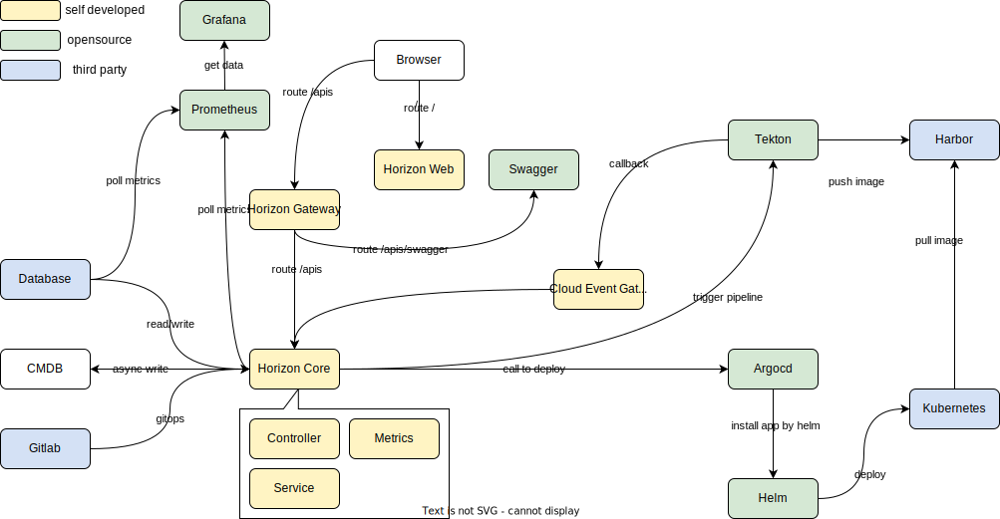

# Horizon

> One-stop enterprise container CICD PaaS platform, 
> practicing Gitops + application-centric concept, 
> theoretically satisfying the delivery needs of all types of loads, 
> supporting fast multi-cloud delivery and custom CI pipelines.

## Introduction



* Horizon gets projects from gitlab, and store some info on it to
support rollback.
* Horizon supports hook for async tasks,
for example pushing data to cmdb or callback.
* Fully supported metrics, horizon natively supports
prometheus, with grafana, we can draw a straightforward diagram.
* With swagger, apis are supported on swagger.
* Ci depends on tekton, Horizon triggers tekton pipeline,
tekton builds and pushs image to harbor.
* CD depends on argoCD, argo calls helm.
Helm renders files deploys on kubernetes.
* Horizon defines all kinds of template for different projects, 
like javaapp, nodejs or dockerfile.

## Develop

### 配置 git pre-commit hooks

#### Install pre-commit

* Linux/Windows/Mac

```shell
pip install pre-commit
```

* Mac

```shell
brew install pre-commit
```

#### Install the git hook scripts

```shell
pre-commit install
```

Commits can only be successfully committed
after passing the hooks defined by 
the **.pre-commit-config.yaml** file 
in the root directory
